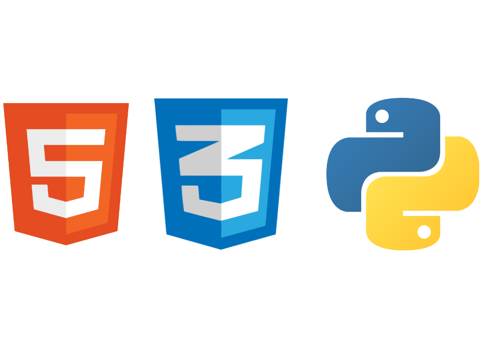

<h1>Olá! Meu nome é Henrique César</h1>

<ul>
  <li> 1️⃣3️⃣anos</li>
  <li> 💻estudante de programação</li>
  <li> 📙Aprendendo <b>Javascript</b> </li>
  <li> 👨‍💻Eu gosto de programar e pretendo conseguir um emprego como <b>desenvolvedor front-end</b> </li>
</ul>

  

  
  <h2>Contato: </h2>
  
<a href="mailto:henriquecesar1395@gmail.com">

